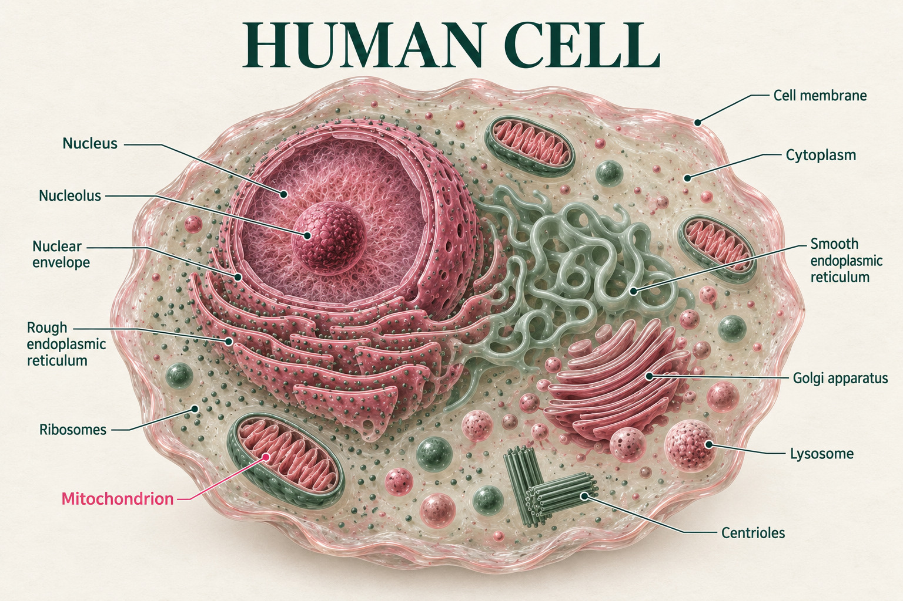
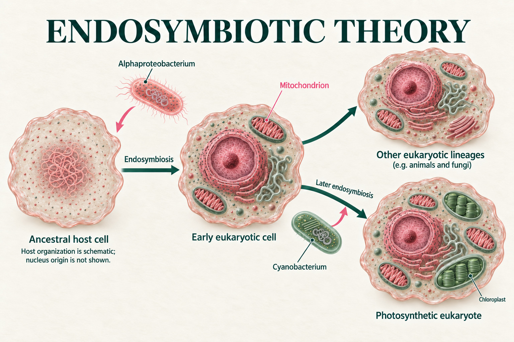
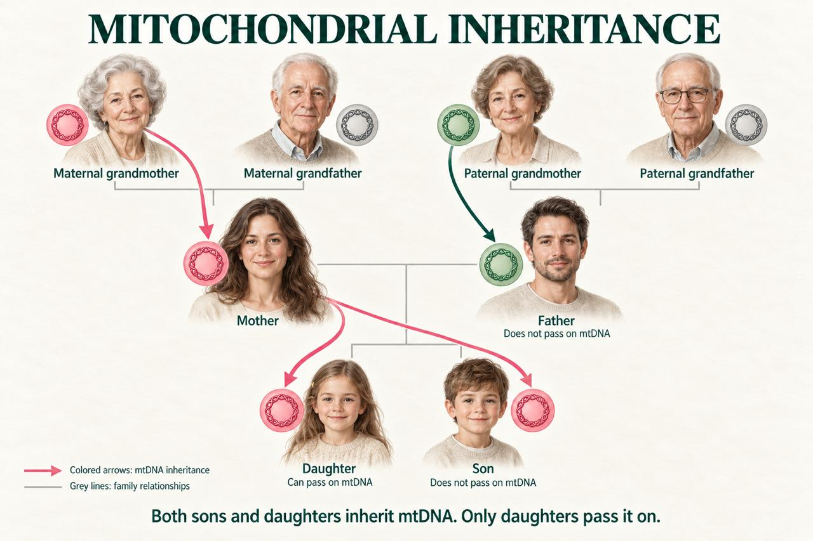

::: {.quip}
Two billion years later, the tenants are still paying rent in ATP.
:::

*"The mitochondria is the powerhouse of the cell"* is pretty much all I remembered from school biology. Then I started learning it properly and found out that this little organelle has its own DNA, a two-billion-year-old backstory, and a very particular way of being passed down in families. Here's what surprised me most.

## More than a powerhouse

Our cells contain different parts, and each of them has its own job. These parts are called organelles. One of them, *the mitochondrion*, works as the "powerhouse of the cell": it breaks down sugars, fats, and sometimes even proteins, and turns them into energy that the cell stores in molecules of adenosine triphosphate, or ATP for short.

Mitochondria are often pictured as beans floating in the fluid inside the cell, the *cytosol*. But in fact, they are constantly on the move: special motor proteins pull them along the cell's "skeleton", called the *cytoskeleton*. Thanks to this, mitochondria can end up exactly where energy is needed most. 

I used to think there was only one mitochondrion in a cell, because that is how cells are usually drawn in diagrams. It turns out that is not true: a cell can contain many mitochondria, and where a lot of energy is needed, there can be several thousand of them in a single cell — for example, in neurons and heart muscle cells. What's more, mitochondria can divide and fuse with each other, adjusting their number to the cell's needs.

{.lightbox group="mitochondria" fig-alt="Illustration of a human cell with the nucleus, endoplasmic reticulum, Golgi apparatus, lysosomes and several mitochondria"}

## Swallowed but not broken

Here is one of the most surprising facts: mitochondria have their own DNA! And it is not like the DNA stored in the nucleus. Nuclear DNA is organized into long chromosomes and tucked away behind the nuclear envelope, while mitochondrial DNA is a small ring that lies right inside the organelle. Bacteria have similar circular DNA — and that is no coincidence. 

This is explained by the endosymbiotic theory [@roger2017]. About two billion years ago, the ancestors of mitochondria were independent bacteria. At some point a larger cell engulfed one of these bacteria, but did not digest it, and the bacterium stayed alive inside. The result was a mutually beneficial partnership: the larger cell supplied the bacterium with nutrients, and the bacterium turned them into energy. Hence the name: "endo" means inside, and "symbiosis" means living together to the benefit of both.

By the way, the same thing happened to chloroplasts, the organelles that make plants green. They were once bacteria too, just a different kind: cyanobacteria that could photosynthesize.

{.lightbox group="mitochondria" fig-alt="Diagram: a host cell engulfs an alphaproteobacterium that becomes a mitochondrion; later a cyanobacterium becomes a chloroplast"}

It would be logical to assume that the other organelles were once bacteria too, swallowed by big Pac-Men. But that is not the case. According to the leading hypothesis, the endoplasmic reticulum, lysosomes and the Golgi apparatus were "molded" out of the cell's own membrane. Imagine pressing your finger into a balloon: a pocket forms on the surface. If the edges of the pocket closed and it pinched off, you would get a separate bubble wrapped in its own film. That is how, fold by fold, the cell acquired its internal compartments. And that is why these organelles have no DNA of their own, unlike mitochondria, which arrived from outside with theirs.

## Moving out of a dangerous neighborhood

But why did almost all the genes move to the nucleus instead of staying inside the mitochondria? The thing is, it is dangerous in there. When mitochondria produce energy, electrons are passed along their inner membrane, like on a conveyor belt. Sometimes an electron jumps off the belt too early and collides with oxygen. This produces unstable, aggressive molecules, such as superoxide or hydrogen peroxide. You can think of them as sparks from a stove that burn through everything nearby.

Inside the nucleus, DNA is safe: it is separated from the rest of the cell by the nuclear envelope, which has two membranes, and it is tightly packed and wound around protective proteins. Mitochondrial DNA, on the other hand, lies right next to the "stove" and is almost "naked". Moreover, DNA repair systems are weaker in mitochondria than in the nucleus, so some of the damage stays unrepaired. 

As a result, only 37 genes remain in human mitochondrial DNA [@anderson1981]. It is more beneficial to keep them inside, so that each organelle can adjust its energy production to its own needs without waiting for a command from the nucleus [@allen_why_2015]. 

::: {.spoiler}
These 37 genes are where my December project begins. I am going to take the mitochondrial genomes of humans, mice, fish, flies and yeast and analyze them: why the yeast genome is several times longer than ours even though it has almost the same number of genes, what order the genes are in around the ring, and how mitochondria read the genetic code in their own way, slightly differently from the rest of the cell.
:::

## Hand-me-downs from Mom

And here is a fact that surprised me even more: we inherit almost all of our mitochondria from our moms! A child gets half of its nuclear DNA from its dad, but everything else in the cell, including the mitochondria, comes from the egg. In fact, the egg holds the record for mitochondria: a single egg contains about a hundred thousand of them [@babayev_oocyte_2015]! 

A sperm cell has mitochondria too — they sit at the base of its tail, where they power its swim to the finish line. But after fertilization, the mother's egg marks the father's mitochondria as unnecessary, and they are soon destroyed [@sutovsky_ubiquitin_1999]. Meanwhile, the egg's own mitochondria remain and supply the embryo's first cells with energy while they are still *in fieri*. So that is yet another reason to thank your mom!

{.lightbox group="mitochondria" fig-alt="Family tree: mitochondrial DNA passes from grandmother to mother to both children, while fathers and sons do not pass it on."}

## Summing up

Put it all together, and it sounds almost like science fiction: every one of our cells is home to the descendants of bacteria that were once swallowed but never digested. They still keep their own DNA, work for us, and are passed down only from our mothers. In school, the mitochondrion was just a line for me: "the powerhouse of the cell". It turned out to be a two-billion-year-long story.

I wonder what else in the cell will turn out to be different from how it's drawn in diagrams.